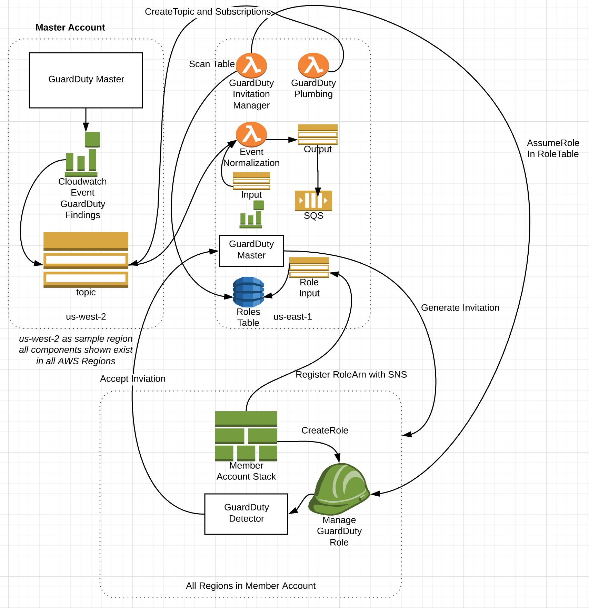

# guardduty-multi-account-manager
A reusable implementation the Mozilla implementation of guardDuty multi account setup with event normalization.

## Architecture

> Above is an example architecture for a master account with a member account.  Note: The member account has guardduty detectors in every region as does the master account.

## Why This?

As a multi-account user of Amazon Web Services you have a few choices when deciding to turn on GuardDuty across your accounts.
Your options are:

1. Stack Sets
2. Human invitations
3. Something else.

Due to the nature of stack sets and the distributed governance of Mozilla it breaks our trust model to grant the needed permissions to run stack sets.
Human behavior consistently generates inconsistent results.

This is why we elected to create GuardDuty Multi-Account Manager

## What is it?

GuardDuty Multi-Account Manager is a series of lambda functions designed to do the following:

* Enable GuardDuty Masters in all AWS Regions present and future.
* Empower account owners to decide to enable GuardDuty
* Manage the lifecycle of invitations to the member accounts
* Aggregate all findings from all detectors in all regions, normalize the data, and send to a single SQS queue

## How do I deploy it?

__Dependencies__

* AWS Organizations and an Assumable Role that is allowed to list all accounts.
* Setup for Cloudformation Cross Account Outputs https://github.com/mozilla/cloudformation-cross-account-outputs/

## Getting Started

* Deploy the Cloudformation Stack from `cloudformation/guardduty-multi-account-manager-parent.yml` in the master account.
* The stack will spin up and create all Master Detectors in all regions, a normalization functions, and all SNS Topics with CloudWatch events.

### Onboarding Accounts

1. Simply apply the cloudformation called: `cloudformation/guardduty-member-accounts-roles.yml` and provide the SNS topic from
cloudformation cross-account-outputs.  The account will then register with the master account and go through the invitation process automatically for every region.

## License

guardduty-multi-account-manager is Licensed under the Mozilla Public License 2.0 ( MPL2.0 )

## Contributors

* Gene Wood
* Andrew Krug
